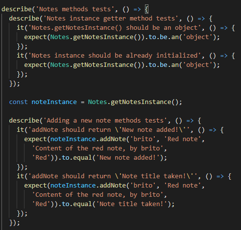
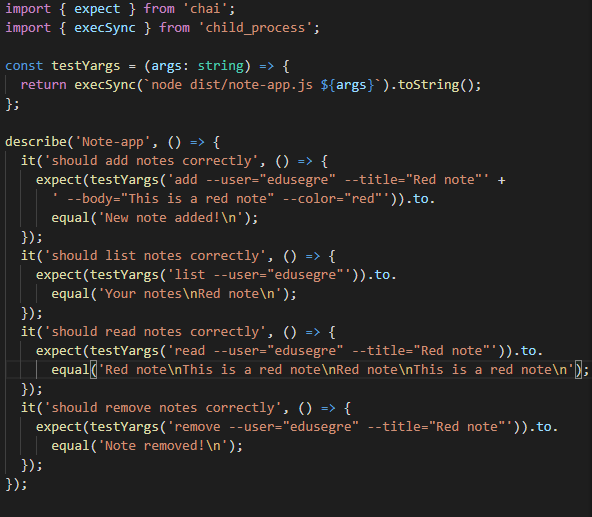
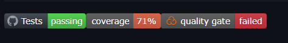

## Introducción

Empezando la segunda parte de la asignatura, se trabajará con la API de Node.js, en concreto con el gestor del sistema de ficheros, es decir, la libreria _fs_.

## Objetivos

- Leer documentación de chalk, yargs y fs.
- Hacer uso de los pull requests de GitHub.
- Repasar los principios SOLID.
- Escribir pruebas para cada ejercicio.
- Resolver los ejercicios propuestos.
- Mantenerse dentro del ámbito de las soluciones propuestas (no utilizar elementos del lenguaje todavia no impartidos en clase).
- Elaborar un informe que explique lo realizado.
- Documentar los ejercicios.

## Diseño previo

Se optó por un diseño sencillo, para poder centrarnos en el trabajo con fs. En este caso, se implemento una clase Notes que siguiera el patron singleton, teniendo en cuenta que no surgiría la necesidad de instanciar la clase en mas de una ocasión.

Una potencial mejora de diseño seria desvincular toda la operatoria de las notas con la operatoria de almacenamiento en ficheros.

## Implementacion de clases base, testing

Para la implementación, se siguió la metodología TDD, diseñando los tests, prediciendo el comportamiento de las clases previo a su desarrollo. Un ejemplo de los tests diseñados sería:

Algo curioso es que los tests para yargs no pasan en la github action, a pesar de que si funcionan correctamente en local.

La implementación del diseño de clases fue sencillo, tras lo comentado anteriormente, en donde solo tenemos dos ficheros de fuente: notes.ts y note-app.ts

_Métodos de ejemplo en la clase Notes_

## Integracion continua

Para cumplir con los requisitos del guión, se configuraron Coveralls y SonarCloud a través de GitHub Actions. Tambien se configuró una acción que ejecuta los tests en dos versiones de Node.js (Las versiones 10.x y 12.x no reconocen los metodos de fs).

Finalmente, tras acabar de configurar todo lo necesario para que se lanzen correctamente las acciones de Github, nuestro repositorio tiene un aspecto similar al siguiente: 

## Conclusiones

Durante el desarrollo, la fase del diseño de clases fue la mas sencilla, teniendo en cuenta como se ha practicado esto en las prácticas anteriores. Tras realizar los tests correspondientes, se inició el desarrollo de la interfaz de usuario con lowdb. La mayor complicación se encontró en la necesidad de trabajar con asincronía a pesar de no haberla impartido. Otro inconveniente, fue que el ejemplo del libro para inquirer y lowdb era sustancialmente mas sencillo que lo que se solicitaba en el guión con lo cual no lo pudimos usar demasiado como ejemplo. De resto, el proceso de diseño y codificación fue encontrado satisfactorio, salvo por dos funcionalidades que no se pudieron implementar por falta de tiempo, vease la lectura del JSON generado por LowDB y, por otra parte, agregar platos adicionales a menus existentes falla.
## Bibliografía

Inquirer.js (s.f.). En _NPM_. Recuperado el 10 de abril de 2021 de https://www.npmjs.com/package/inquirer

Lowdb (s.f.). En _NPM_. Recuperado el 10 de abril de 2021 de https://www.npmjs.com/package/lowdb

SOLID principles using TypeScript (s.f.). En _SamuelEresca.net_. Recuperado el 13 de marzo de 2021 de https://samueleresca.net/solid-principles-using-typescript/

